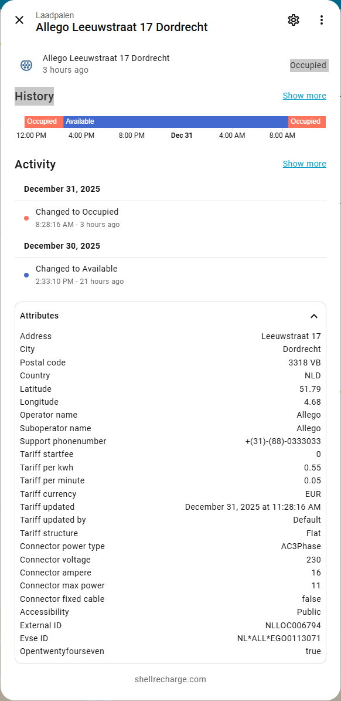
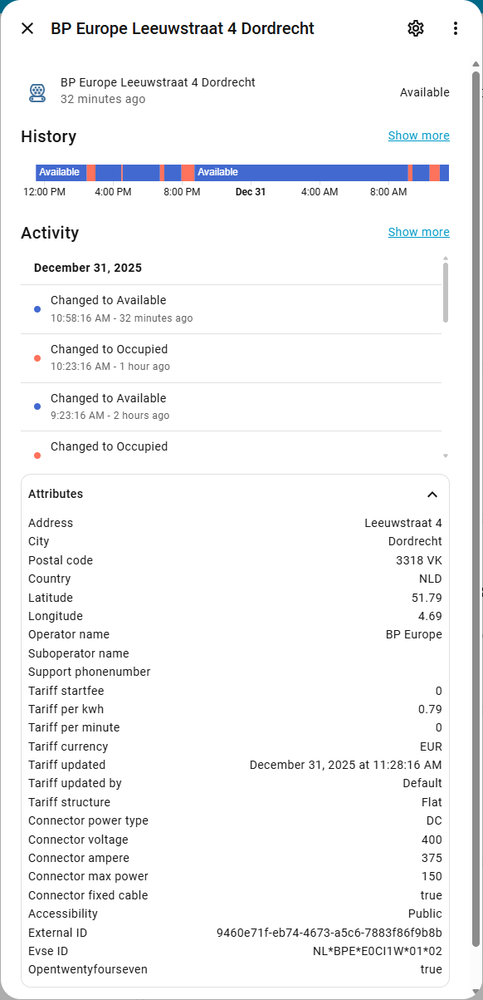

[![GitHub Release][releases-shield]][releases]
[![GitHub Activity][commits-shield]][commits]
[![License][license-shield]](LICENSE)
![Project Maintenance][maintenance-shield]

[](https://www.paypal.me/cyberjunkynl/)
[](https://github.com/sponsors/cyberjunky)

# Shell Recharge Custom Integration

The Shell Recharge integration allows you to expose data from EV chargers on shellrecharge.com to Home Assistant. It also has support for Private Charging.

**This integration will set up the following platforms.**

## Supported Features

Monitor public EV chargers with a sensor that shows charger status:

- **Status**: "Available", "Unavailable", "Occupied", "Unknown"

The sensor exposes the following attributes:

| Attribute | Example Value |
| --- | --- |
| **Address** | |
| Address | Example Street 1 |
| City | Amsterdam |
| Postal code | 1234 AB |
| Country | NLD |
| **Coordinates** | |
| Latitude | 52.00 |
| Longitude | 4.00 |
| **Operator** | |
| Operator name | BP Europe |
| Suboperator name | |
| Support phonenumber | |
| **Tariff** | |
| Start fee | 0 |
| Per kWh | 0.79 |
| Per minute | 0 |
| Currency | EUR |
| Updated | December 31, 2025 at 11:28:16 AM |
| Updated by | Default |
| Structure | Flat |
| **Connector** | |
| Power type | DC |
| Voltage | 400 |
| Ampere | 375 |
| Max power | 150 |
| Fixed cable | true |
| **Accessibility** | |
| Accessibility | Public |
| Opentwentyfourseven | true |
| **Identification** | |
| External ID | xxxxxxxx-xxxx-xxxx-xxxx-xxxxxxxxxxxx |
| Evse ID | NL*XXX*E00000*00*00 |


Monitor private EV chargers with a sensor that shows charger status:

- **Status**: "Available", "Unavailable", "Occupied", "Unknown", "Charging", "Faulted"

The sensor exposes the following attributes:

| Attribute | Example Value |
| --- | --- |
| **Charge Point** | |
| Name | My Home Charger |
| Serial | XXXXXXXXX |
| Model | NewMotion |
| Vendor | NewMotion |
| UUID | xxxxxxxx-xxxx-xxxx-xxxx-xxxxxxxxxxxx |
| Protocol | ocpp 1.6-j |
| Sharing | private |
| **Address** | |
| Street | Example Street |
| Number | 1 |
| City | Amsterdam |
| Zip | 1234 AB |
| Country | NLD |
| **Coordinates** | |
| Latitude | 52.00 |
| Longitude | 4.00 |
| **Connectivity** | |
| Connectivity | online |
| First connection | 2024-01-15T10:30:00Z |
| Last connection | 2025-12-31T11:00:00Z |
| Last session | 2025-12-30T18:45:00Z |
| Latest online status | true |
| Last changed | 2025-12-31T11:00:00Z |
| **Plug & Charge** | |
| Capable | true |
| **EVSE** | |
| Evse ID | NL*XXX*E00000*00 |
| Number | 1 |
| Status | available |
| Current type | ac |
| Max power | 22000 |
| **Connector** | |
| Connector type | Type2 |
| Electric current type | AC |
| Max current in amps | 32 |
| Max power in watts | 22000 |
| Number of phases | 3 |
| **Tariff** | |
| Start fee | 0 |
| Per kWh | 0.25 |
| Per minute | 0 |
| Currency | EUR |
| Updated | 2025-12-31T10:00:00Z |
| Updated by | TariffService |
| Structure | Flat |
| **Occupying Token** | |
| RFID | XX-XXX-XXXXXX-X |
| Printed number | XXXXXX |
| Timestamp | 2025-12-30T18:45:00Z |

All sensors are created by default and grouped under a single device for easy management.

## Screenshots

  

## Requirements

For public EV chargers:

- **Charger Serial Number**

Look up the Serial Number here: https://ui-map.shellrecharge.com (inside details section).

For private EV chargers:

- **Your Shell Recharge account details**

## Installation

[](https://my.home-assistant.io/redirect/hacs_repository/?owner=cyberjunky&repository=home-assistant-shell_recharge&category=integration)

Alternatively:

1. Install [HACS](https://hacs.xyz) if not already installed
2. Search for "Shell Recharge" in HACS
3. Click **Download**
4. Restart Home Assistant
5. Add via Settings → Devices & Services

### Manual Installation

1. Copy the `custom_components/shell_recharge` folder to your `<config>/custom_components/` directory
2. Restart Home Assistant
3. Add via Settings → Devices & Services

## Configuration

### Adding a Public Charger

1. Navigate to **Settings** → **Devices & Services**
2. Click **+ Add Integration**
3. Search for **"Shell Recharge"**
4. Select **"Public Charger"**
5. Enter the **Serial Number** of the charger

> [!TIP]
> Find the Serial Number on [Shell Recharge Map](https://ui-map.shellrecharge.com) - click on a charger and look in the details section.

The integration creates a sensor for the charger status with all location, tariff, and connector attributes.

### Adding a Private Charger

1. Navigate to **Settings** → **Devices & Services**
2. Click **+ Add Integration**
3. Search for **"Shell Recharge"**
4. Select **"Private Charger"**
5. Enter your Shell Recharge account credentials:
   - **Email**: Your Shell Recharge account email
   - **Password**: Your account password

The integration discovers all chargers linked to your account and creates sensors for each EVSE with detailed attributes including connectivity, tariff, and charging status.

### Modifying Settings

1. Go to **Settings** → **Devices & Services**
2. Find **Shell Recharge**
3. Click the **Configure** icon
4. Modify settings as needed
5. Click **Submit**

## Advanced Usage

### Automation Examples

The following automation examples are based on the excellent article by Olaf Weijers on [Tweakers.net](https://tweakers.net/reviews/12918/laad-je-auto-slim-op-met-home-assistant-zo-vind-je-altijd-een-vrije-plek.html).

#### Charger Availability Notification

Get notified when a charger status changes to available:

```yaml
automation:
  - alias: "Charger Available"
    triggers:
      - trigger: state
        entity_id:
          - sensor.charger_1
          - sensor.charger_2
        from: "Occupied"
        to: "Available"
    actions:
      - action: notify.mobile_app_phone
        data:
          message: >-
            Charger {{ trigger.to_state.attributes.friendly_name }} is now {{ trigger.to_state.state }}.
```

#### Charging Check on Arrival

Checks if your preferred charging spots are available when you arrive home with low battery. Notifies you of alternative spots if your favorites are occupied:

```yaml
automation:
  - alias: "Charging Check on Arrival"
    triggers:
      - entity_id: sensor.your_distance_to_home
        below: 2500
        trigger: numeric_state
    conditions:
      - condition: numeric_state
        entity_id: sensor.car_battery_level
        below: 50
      - condition: state
        entity_id: sensor.your_direction_of_travel
        state: towards
    actions:
      - variables:
          preferred_chargers:
            - sensor.charger_1
            - sensor.charger_2
          alternative_chargers:
            - sensor.charger_3
            - sensor.charger_4
      - choose:
          - conditions:
              - condition: template
                value_template: >
                  {{ preferred_chargers | select('is_state', 'Available') | list | length > 0 }}
            sequence: []
          - conditions:
              - condition: template
                value_template: >
                  {{ alternative_chargers | select('is_state', 'Available') | list | length > 0 }}
            sequence:
              - variables:
                  available_chargers: >
                    {{ alternative_chargers | select('is_state', 'Available') | list }}
              - action: notify.mobile_app_phone
                data:
                  title: Preferred spots occupied
                  message: >
                    Available alternatives: 
                    {{ states[charger].name }}, 
                    
          - conditions:
              - condition: template
                value_template: >
                  {{ preferred_chargers | select('is_state', 'Available') | list | length == 0 and
                     alternative_chargers | select('is_state', 'Available') | list | length == 0 }}
            sequence:
              - action: notify.mobile_app_phone
                data:
                  title: No charging spots available
                  message: All charging spots are currently occupied.
```

#### Waiting for Parking Spot

Use an input_boolean helper to get notified when a spot becomes available. Create the helper in **Settings** → **Devices & Services** → **Helpers** → **Create helper** → **Toggle**:

```yaml
automation:
  - alias: "Parking Spot Notification"
    triggers:
      - trigger: state
        entity_id:
          - sensor.charger_1
          - sensor.charger_2
          - sensor.charger_3
          - sensor.charger_4
        to: Available
        from: Occupied
    conditions:
      - condition: state
        entity_id: input_boolean.waiting_for_parking_spot
        state: "on"
    actions:
      - action: notify.mobile_app_phone
        data:
          title: Parking spot available!
          message: A charging spot is now free.
      - action: input_boolean.turn_off
        target:
          entity_id: input_boolean.waiting_for_parking_spot
```

Optional dashboard tile that only appears when all spots are occupied:

```yaml
type: tile
entity: input_boolean.waiting_for_parking_spot
name: Wait for spot
visibility:
  - condition: state
    entity: sensor.charger_1
    state: Occupied
  - condition: state
    entity: sensor.charger_2
    state: Occupied
tap_action:
  action: toggle
```

#### Charger Hogging Notification

Get notified when all nearby chargers are occupied while your car is fully charged but still connected. Helps prevent blocking others from charging:

```yaml
automation:
  - alias: "Charger Hogging Notification"
    triggers:
      - trigger: state
        entity_id:
          - sensor.charger_1
          - sensor.charger_2
          - sensor.charger_3
          - sensor.charger_4
      - trigger: state
        entity_id: switch.car_charging
        to: "off"
    conditions:
      - condition: state
        entity_id: sensor.charger_1
        state: Occupied
      - condition: state
        entity_id: sensor.charger_2
        state: Occupied
      - condition: state
        entity_id: binary_sensor.car_charging_cable_connected
        state: "on"
      - condition: state
        entity_id: switch.car_charging
        state: "off"
      - condition: state
        entity_id: device_tracker.car_position
        state: home
      - condition: numeric_state
        entity_id: sensor.car_battery_level
        above: 75
      - condition: time
        after: "08:00:00"
        before: "23:30:00"
    actions:
      - action: notify.mobile_app_phone
        data:
          title: All spots are occupied
          message: Your car is fully charged. Consider moving it for others.
      - delay:
          minutes: 30
    mode: single
```

#### Charging Status Check

Verify that charging actually started after plugging in. Useful to catch forgotten badge swipes or loose plugs:

```yaml
automation:
  - alias: "Charging Status Check"
    triggers:
      - trigger: state
        entity_id: binary_sensor.car_charging_cable_connected
        to: "on"
        for:
          minutes: 15
    actions:
      - if:
          - condition: state
            entity_id: switch.car_charging
            state: "off"
        then:
          - action: notify.mobile_app_phone
            data:
              title: Did you forget something?
              message: Your car is plugged in but not charging.
```

## Troubleshooting

### Enable Debug Logging

Add to `configuration.yaml`:

```yaml
logger:
  default: info
  logs:
    custom_components.shell_recharge: debug
```

Alternatively, enable debug logging via the UI in **Settings** → **Devices & Services** → **Shell Recharge** → **Enable debug logging**:


Then perform any steps to reproduce the issue and disable debug logging again. It will download the relevant log file automatically.

## Common Issues

**Chargepoints get unavailable**

 - Sometimes added chargepoints get unavailable, most of the time this is because of serial number has changed, simply delete and re-add them with new serial.

## Development

Quick-start (from project root):

```bash
python3 -m venv .venv
source .venv/bin/activate
python -m pip install --upgrade pip
pip install -r requirements_lint.txt
./scripts/lint    # runs pre-commit + vulture
# or: ruff check .
# to auto-fix: ruff check . --fix
```

## 💖 Support This Project

If you find this integration useful, please consider supporting its continued development:

### 🌟 Ways to Support

- **⭐ Star this repository** - Help others discover the project
- **💰 Financial Support** - Contribute to development and hosting costs
- **🐛 Report Issues** - Help improve stability and compatibility
- **📖 Spread the Word** - Share with other solar enthusiasts

### 💳 Financial Support Options

[](https://www.paypal.me/cyberjunkynl/)
[](https://github.com/sponsors/cyberjunky)

## License

This project is licensed under the MIT License - see the [LICENSE](LICENSE) file for details.

---

[releases-shield]: https://img.shields.io/github/release/cyberjunky/home-assistant-shell_recharge.svg?style=for-the-badge
[releases]: https://github.com/cyberjunky/home-assistant-shell_recharge/releases
[commits-shield]: https://img.shields.io/github/commit-activity/y/cyberjunky/home-assistant-shell_recharge.svg?style=for-the-badge
[commits]: https://github.com/cyberjunky/home-assistant-shell_recharge/commits/main
[license-shield]: https://img.shields.io/github/license/cyberjunky/home-assistant-shell_recharge.svg?style=for-the-badge
[maintenance-shield]: https://img.shields.io/badge/maintainer-cyberjunky-blue.svg?style=for-the-badge
